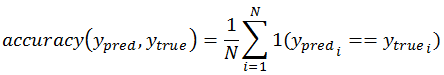

# DeepLearning

## Содержание
* [Постановка задачи](#Постановка-задачи)
* [Тренировочные и тестовые наборы данных](#Тренировочные-и-тестовые-наборы-данных)
* [Метрика качества решения задачи](#Метрика-качества-решения-задачи)
* [Исходный формат хранения данных](#Исходный-формат-хранения-данных)
* [Формат данных, предоставляющийся на вход сети](#Формат-данных,-предоставляющиеся-на-вход-сети)

## Постановка задачи
Выполнение практической работы предполагает решение следующих задач:
1. Выбор библиотеки для выполнения практических работ курса.
2. Установка выбранной библиотеки.
3. Проверка корректности установки библиотеки. Разработка и запуск тестового примера сети,
соответствующей логистической регрессии, для решения задачи классификации рукописных
цифр набора данных MNIST.
4. Выбор практической задачи компьютерного зрения для выполнения практических работ.
5. Разработка программ/скриптов для подготовки тренировочных и тестовых данных в формате,
который обрабатывается выбранной библиотекой.
6. Разработка нескольких архитектур полностью связанных нейронных сетей (варьируются
количество слоев и виды функций активации на каждом слое) в формате, который принимается
выбранной библиотекой.
7. Обучение разработанных глубоких моделей.
8. Тестирование обученных глубоких моделей.
9. Публикация разработанных программ/скриптов в репозитории на GitHub.
10. Подготовка отчета, содержащего минимальный объем информации по каждому этапу
выполнения работы.
## Тренировочные и тестовые наборы данных
Выбранная задача - Intel Image Classification (https://www.kaggle.com/puneet6060/intel-image-classification).

Эти данные содержат около 25 тыс. цветных изображений размером 150x150, распределенных по 6 категориям: здания, лес, ледник, гора, море, улица. Изображения хранятся в фомате jpg.

Тренировочная выборка содержит 14034 изображений.

Тестовая выборка содержит 3000 изображений.

Размер каждого изображения 150x150.

## Метрика качества решения задачи
Для оценки качества решения задачи выбрана метрика "Точность"("Accuracy"). Она вычисляет как часто прогнозы соответствуют меткам. Иными словами, частота с которой y_pred совпадает с y_true.

## Исходный формат хранения данных
Исходные данные хранятся в директориях `seg_pred`, `seg_test`, `seg_train` в формате jpg и размера 150x150.
- `seg_pred` содержит 7301 изображений
- `seg_test` - 3000 изображений, которые распределены по папкам
   - `buildings`
   - `forest`
   - `glacier`
   - `mountain`
   - `sea`
   - `street`
- `seg_train` - 14034 изображений, которые распределены по папкам
   - `buildings`
   - `forest`
   - `glacier`
   - `mountain`
   - `sea`
   - `street`
## Формат данных, предоставляющийся на вход сети
Мы генерируем пакеты данных с помощью класса ImageDataGenerator и его метода flow_from_directory(). 
Данные возвращаются в формате (x, y), где x, y - numpy массивы. 
x имеет форму (batch_size, 150, 150, 3).
y имеет форму (batch_size, 6).
Методу fit_generator подается на вход генератор данных в формате (x, y).
Сети подается на вход массив numpy формата (150, 150, 3), который "сглаживается" сетью с помощью метода Flatten().
## Результаты

|№ лабораторной работы|Конфигурация сети|Точность на тестовом множестве (%)|Время,с|
|--|--|--|--|
|2|Полносвязная сеть|57.93|525|
|3|Сверточная сеть|80.83|603|
|4|Полносвязная сеть| | |
|5|VGG16|88.17|675|
