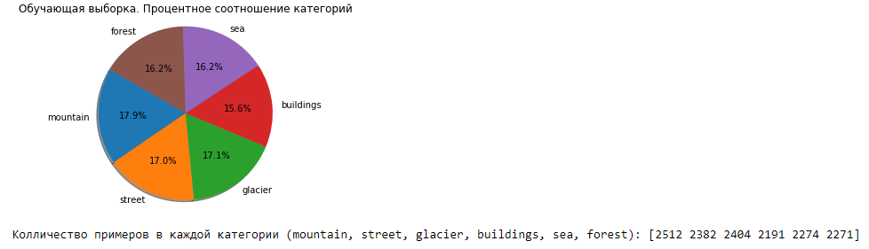

# DeepLearning

## Содержание
* [Постановка задачи](#Постановка-задачи)
* [Тренировочные и тестовые наборы данных](#Тренировочные-и-тестовые-наборы-данных)
* [Метрика качества решения задачи](#Метрика-качества-решения-задачи)
* [Исходный формат хранения данных](#Исходный-формат-хранения-данных)
* [Формат данных, предоставляющийся на вход сети](#Формат-данных,-предоставляющиеся-на-вход-сети)
* [Описание разработанного программного кода](#Описание-разработанного-программного-кода)
* [Тестовые конфигурации сетей](#Тестовые-конфигурации-сетей)
* [Эксперименты](#Эксперименты)

## Постановка задачи
Выполнение практической работы предполагает решение следующих задач:
1. Выбор библиотеки для выполнения практических работ курса.
2. Установка выбранной библиотеки.
3. Проверка корректности установки библиотеки. Разработка и запуск тестового примера сети,
соответствующей логистической регрессии, для решения задачи классификации рукописных
цифр набора данных MNIST.
4. Выбор практической задачи компьютерного зрения для выполнения практических работ.
5. Разработка программ/скриптов для подготовки тренировочных и тестовых данных в формате,
который обрабатывается выбранной библиотекой.
6. Разработка нескольких архитектур полностью связанных нейронных сетей (варьируются
количество слоев и виды функций активации на каждом слое) в формате, который принимается
выбранной библиотекой.
7. Обучение разработанных глубоких моделей.
8. Тестирование обученных глубоких моделей.
9. Публикация разработанных программ/скриптов в репозитории на GitHub.
10. Подготовка отчета, содержащего минимальный объем информации по каждому этапу
выполнения работы.
## Тренировочные и тестовые наборы данных
Выбранная задача - Intel Image Classification (https://www.kaggle.com/puneet6060/intel-image-classification).

Эти данные содержат около 25 тыс. цветных изображений размером 150x150, распределенных по 6 категориям: здания, лес, ледник, гора, море, улица.

Тренировочная выборка содержит 14034 изображений.

Тестовая выборка содержит 3000 изображений.

Размер каждого изображения 150x150.

## Метрика качества решения задачи
## Исходный формат хранения данных
## Формат данных, предоставляющийся на вход сети
## Описание разработанного программного кода
## Тестовые конфигурации сетей
## Эксперименты
